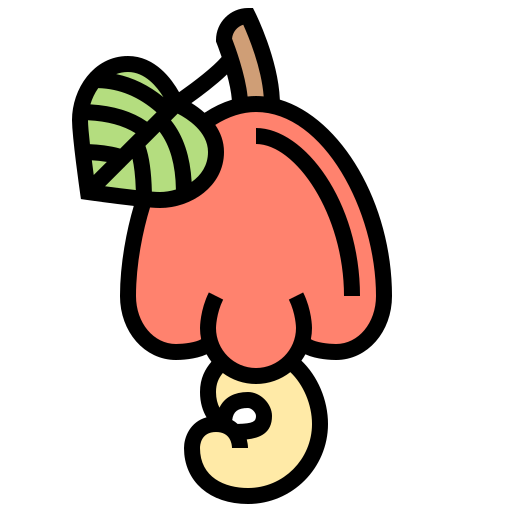

<h1 align="center">
    
    <br>Caju - Encurtador de Links<br/>
</h1>

<p align="center">


 
 
</p>

---

<p align="center">
  <a href="#page_with_curl-sobre">Sobre</a>&nbsp;&nbsp;&nbsp;|&nbsp;&nbsp;&nbsp;
  <a href="#books-requisitos">Requisitos</a>&nbsp;&nbsp;&nbsp;|&nbsp;&nbsp;&nbsp;
  <a href="#rocket-começando">Começando</a>&nbsp;&nbsp;&nbsp;|&nbsp;&nbsp;&nbsp;
  <a href="https://ronierlima.github.io/flexblog/">Demo</a>&nbsp;&nbsp;&nbsp;|&nbsp;&nbsp;&nbsp;
</>

## :page_with_curl: Sobre 

O **Caju** é uma aplicação Web que possibilita aos usuários encurtar e vizualizar estatísticas da URL que ele resolveu encurtar.
Essa aplicação foi realizada durante a **Semana Full Stack JS**, projeto do professor [Luiz Duarte](https://www.luiztools.com.br) que idealizou o nome Pitu, mas eu gosto é de **Caju**.

## :hammer: Tecnologias
Esse projeto foi desenvolvido com as seguintes tecnologias:

-  [ReactJS](https://reactjs.org/)
-  [Node.js](https://nodejs.org/en/)
-  [MySQL](https://www.mysql.com/)
---
-  [Axios](https://github.com/axios/axios)
-  [Date-fns](https://date-fns.org/)
-  [Express](https://expressjs.com/)
-  [NPM](https://www.npmjs.com/)
-  [React Bootstrap](https://react-bootstrap.github.io/)
-  [SCSS](https://sass-lang.com/)
-  [Styled Components](https://styled-components.com/)
-  [Typescript](https://www.typescriptlang.org/)
-  [Yarn](https://yarnpkg.com/)
## :books: Requisitos

- É **necessário** possuir o **[Node.js](https://nodejs.org/en/)** instalado no computador.
- É **necessário** possuir o **[Git](https://git-scm.com/)** instalado e configurado no computador para clonar o projeto..
- Também, é **preciso** ter um gerenciador de pacotes seja o **[Yarn](https://yarnpkg.com/)** ou **[NPM](https://www.npmjs.com/)**.
- Por fim, é **essencial** ter o **[MySQL](https://www.mysql.com/)** instalado na máquina.

## :rocket: Começando

1. Faça um clone do repositório:

```sh
  $ git clone https://github.com/ronierlima/caju.git
```

2. Executando a Aplicação:

```sh
  # API
  $ cd backend
  # Instalando as dependências do projeto.
  $ npm install # yarn install
  # Inicie a API
  $ npm start # ou yarn start

  # CONEXÃO COM BANCO DE DADOS MYSQL
  # backend > connection.ts
  # mysql://<USUARIO>:<SENHA_MY_SQL>@<SUA_URL>:3306/<NOME_DO_BANCO_DE_DADOS>

  # APLICAÇÃO WEB
  $ cd frontend
  # Instalando as dependências do projeto.
  $ yarn install # ou npm install
  # Inicie a aplicação web
  $ yarn start # ou npm start
```

Feito com ❤️ por [Ronier Lima](https://github.com/ronierlima)